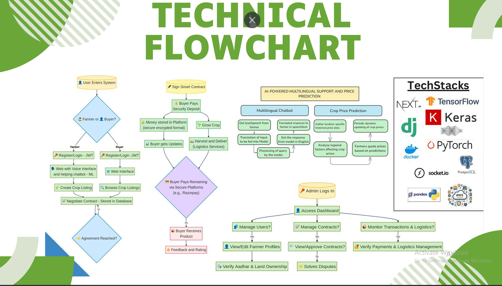
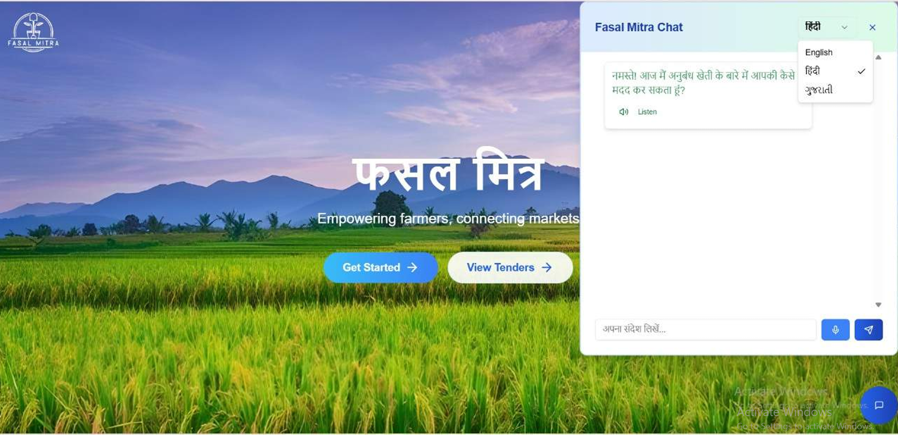
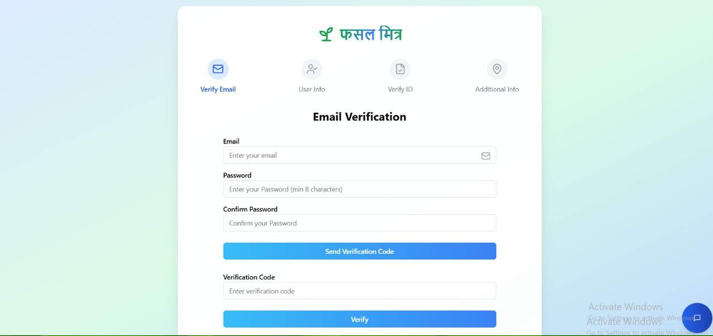
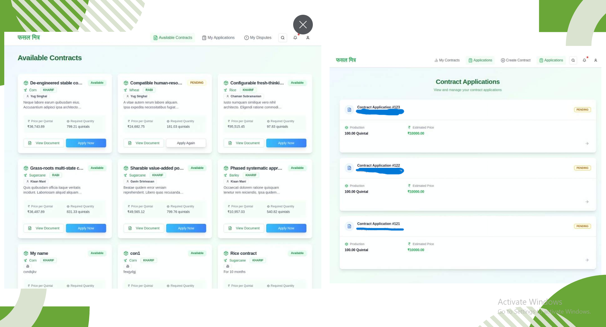
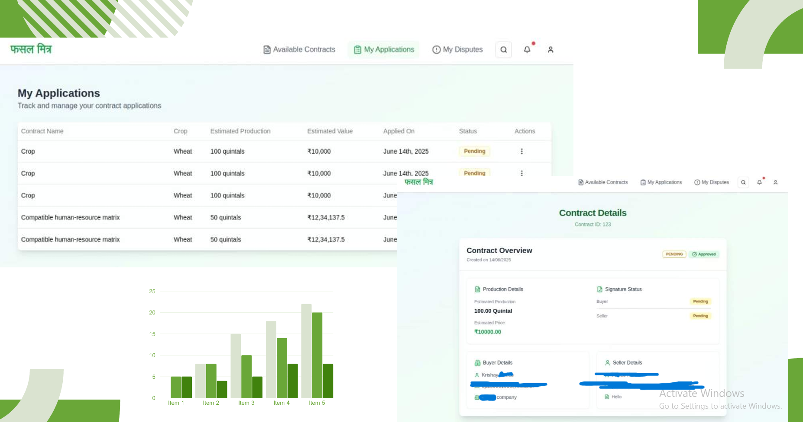
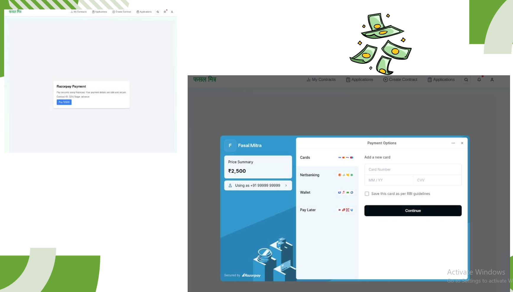

# Assured Contract Farming Platform (Demo)

**Disclaimer:**  
This repository is **only for demonstration purposes** (sample incomplete code only). The full production code is private but **available on request** (for verification purposes).

---

## Live Demo

[View the demo site](https://fasalmitra-delta.vercel.app/)

---

## Key Features

- **Verified Onboarding:**  
  Aadhar-based verification of farmers and buyers, including land ownership checks to ensure trust and authenticity.

- **Contract Management:**  
  Digital contracts are established before each season, specifying crop details and pricing to guarantee income stability.

- **Real-Time Negotiation:**  
  Integrated price negotiation between farmers and buyers within the platform.

- **Secure Payments & Logistics:**  
  Escrow payments via Razorpay and integration with local logistics providers to manage produce delivery and minimize fraud.

- **Multilingual & Multi-Platform:**  
  Accessible on smartphones, desktops, and low-cost devices (e.g., JioPhones), supporting multiple Indian languages.

- **Speech-to-Speech Bot:**  
  Guides farmers and buyers in their local language through voice interactions, reducing barriers due to low digital literacy.

- **AI-Powered Insights:**  
  Recommends profitable crops, shares market trends, and educates farmers about sustainable practices.

---

## Impact and Benefits

- **Income Stability:**  
  Reduces farmers’ financial stress via pre-agreed contracts and transparent pricing.
- **Market Expansion:**  
  Broadens farmers’ reach to buyers through verified digital channels.
- **Sustainable Practices:**  
  Promotes eco-friendly farming via AI recommendations and educational resources.
- **Skill Development:**  
  Bridges the digital divide by providing multilingual assistance and a simple UI for all literacy levels.

### Key Features for Trust and Efficiency
- **Legally Binding Contracts**: Digitally signed agreements protect all parties.
- **User Verification**: Aadhaar and geosocial methods ensure authenticity.
- **Regulatory Solution**: Secure and compliant operations.

---

### End-to-End Transaction Management
Step-wise process flow:
1. Farmer Verification
2. Contract Monitoring
3. Delivery Tracking
4. Payment Processing

Ensures transparency and accountability across the supply chain.

---

### Business Model and Key Features
**Business Model**
- Solves unfair contracts and farmer exploitation.
- Simplifies compliance for companies.

**Key Features**
- Expert-reviewed contracts.
- Aadhaar-based verification.
- Digitally signed agreements.
- Full operational support from contract to payment.

---

### Value Proposition
**For Farmers**
- Fair price assurance.
- Legal protection.
- Guaranteed payments.

**For Companies**
- Reliable raw material supply.
- Less operational burden.

**For Government**
- Transparency and regulatory compliance.
- Protection of farmer rights.

---
## 🛠️ Tech Stack

- **Frontend:** Next.js, React, Tailwind CSS
- **Backend:** Django REST Framework, Flask (private)
- **AI/ML:** TensorFlow models for price forecasting and recommendations
- **Payments:** Razorpay API, Cashfree eSign API (verification suite)
- **Infrastructure:** AWS EC2, Docker, Vercel (for frontend deployment)
- **Security:** Aadhar verification, data encryption

---
### Tech Flowchart

## Snippets
Below are the main screens illustrating the project features and research references.

### References
Highlighting:
- Middlemen impact on farmer profitability.
- Benefits of contract farming.
- Digital divide challenges in agriculture.
- FAO resources on digital agriculture.
## 🔗 References and Research

- [Middlemen Impact on Profits](https://papers.ssrn.com/sol3/papers.cfm?abstract_id=1694096)
- [Contract Farming and Digital Divide](https://www.aarf.asia/current/MDLp9sVFBGBXjQZ.pdf)
- [UAS Bangalore Report](https://www.uasbangalore.edu.in/images/2022-3rd-Issue/2.pdf)
- [Samunnati Digital Divide Article](https://samunnati.com/bridging-the-digital-divide-unveiling-challenges-for-indian-farmers-in-a-digital-age/)
- [FAO Digital Agriculture](https://openknowledge.fao.org/server/api/core/bitstreams/aba25d62-a7a7-4d4e-b761-5e45a128e4cf/content)

